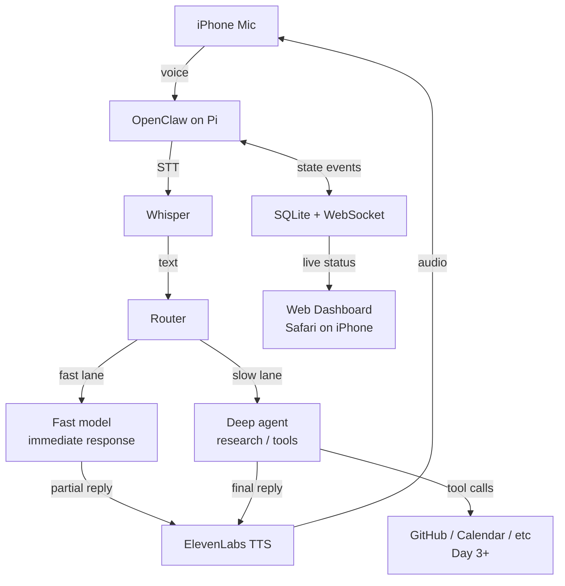

# Architecture

> Living diagram. Updated daily. Diff between v0 and v4 is a presentation slide.

## Current — v0 (2026-05-08)

## Notes

- **Fast lane / slow lane** is the dual-agent pattern. Both fire in parallel on complex queries. User hears the fast model narrating ("I'm pulling your repo, give me a sec...") while the deep agent works.
- **OpenClaw is the gateway.** Everything voice + session + multi-channel routes through it. Custom Python (or Node) glue lives alongside, not above.
- **Dashboard is read-only.** It reflects state, doesn't drive it. WebSocket pushes from the agent process; the page renders.

## Excalidraw version

Maintained in Obsidian vault under `MeTs/architecture-vN.excalidraw`. Export PNG to `/diagrams/` on each major revision and reference here.

| Version | Date | Snapshot |
|---|---|---|
| v0 | 2026-05-08 | (mermaid only — exalidraw export pending) |

## Decision log (deltas from earlier drafts)

- **v0 ← original doc:** dropped LangChain, dropped Convex, dropped native iOS, added fast/slow dual-agent lane, added explicit dashboard contract (read-only).
